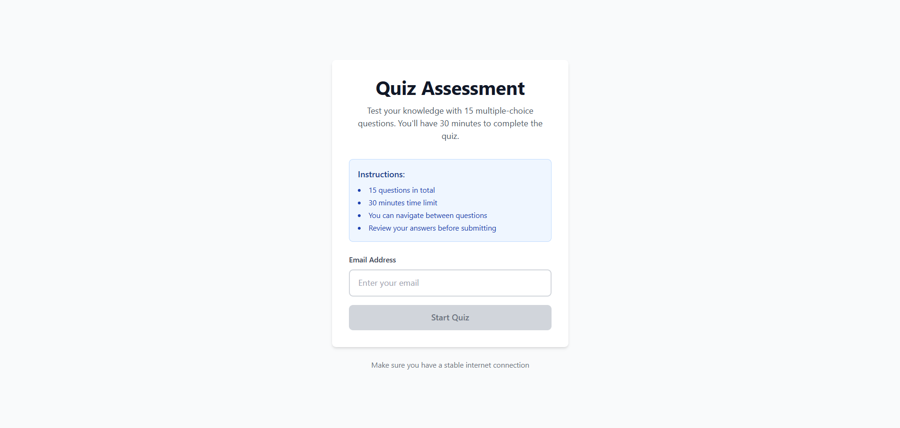
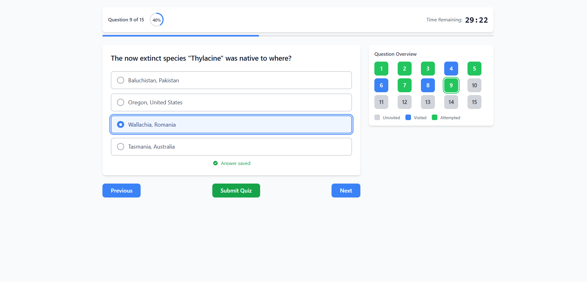
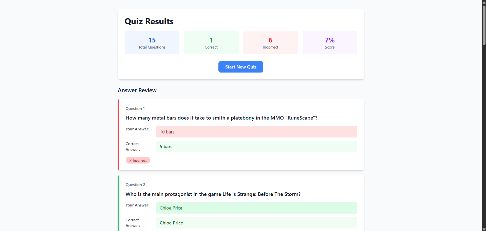
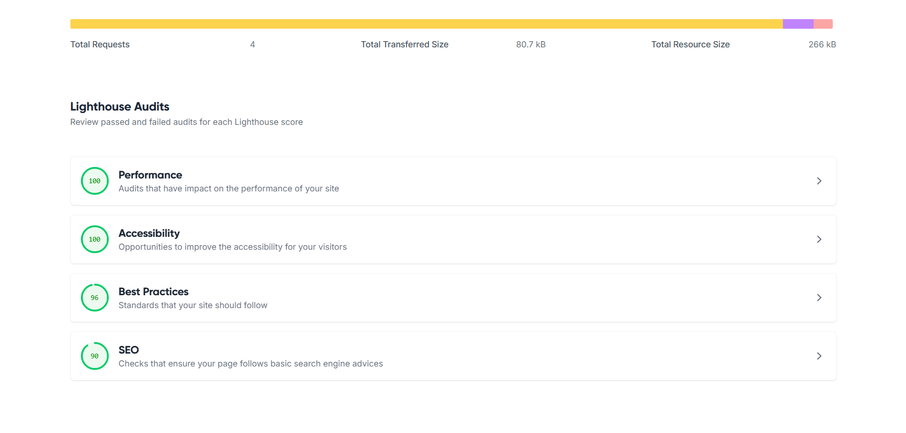

# Quiz Assessment Application

A clean, production-ready quiz application built with React and Vite. This project demonstrates modern frontend development practices with a focus on code quality, user experience, and maintainability.

## 📋 Overview

This application provides a timed quiz experience with 15 multiple-choice questions fetched from the Open Trivia Database API. Users can navigate between questions, track their progress, and review detailed results upon completion. The interface prioritizes clarity and usability over visual complexity, ensuring an assessment-focused experience.

## 🚀 Live Demo

**Live URL:** [https://causalfunnel-quiz.netlify.app/]

### Screenshots

_Start Page - Email validation before quiz begins_


_Quiz Page - Timer, progress tracking, and question navigation_


_Report Page - Detailed results with answer comparison_


### Performance Metrics

The application is optimized for performance, accessibility, and best practices:



**Lighthouse Audit Highlights:**

- ⚡ **Performance**: Optimized bundle size and efficient rendering
- ♿ **Accessibility**: Semantic HTML and ARIA labels for screen readers
- ✅ **Best Practices**: Modern web standards and security considerations
- 🔍 **SEO**: Proper meta tags and structured content

---

## 🎯 Approach & Design Decisions

### Philosophy

The primary goal was to build a **reliable, user-friendly quiz application** that handles real-world edge cases gracefully. Rather than focusing on flashy animations or complex UI patterns, the design emphasizes:

- **Clarity**: Users should always know where they are and what actions are available
- **Reliability**: Data persistence across navigation and graceful error handling
- **Accessibility**: Keyboard navigation, proper ARIA labels, and semantic HTML
- **Performance**: Minimal dependencies and optimized rendering

### Key UX Features

**Timer with Auto-Submit**: A 30-minute countdown prevents indefinite quiz sessions and ensures fair assessment conditions. The timer automatically submits answers when time expires.

**Navigation Panel**: The question overview grid provides instant visibility into quiz progress (unvisited/visited/attempted states), allowing users to strategically manage their time.

**Progress Indicators**: Both a horizontal progress bar and circular percentage indicator give users multiple ways to track completion at a glance.

**Answer Persistence**: Quiz results are stored in sessionStorage, allowing users to refresh the report page without losing data while maintaining session-based security.

**Browser Warnings**: Prevents accidental tab closure during active quizzes, protecting user progress from unintentional actions.

### Implementation Deep Dive

#### 1. Question State Tracking Logic

To provide clear visual feedback in the navigation panel, each question is categorized into one of three states: `unvisited`, `visited`, or `attempted`. This categorization happens automatically as users interact with the quiz.

The state tracking is driven by a simple state array maintained in the `useQuiz` hook:

```javascript
// State array: one status per question
const [questionStatusMap, setQuestionStatusMap] = useState([]);

// Initialize all questions as "unvisited"
setQuestionStatusMap(new Array(data.length).fill("unvisited"));

// When navigating to a question
const goToQuestion = (index) => {
  setQuestionStatusMap((prev) => {
    const updated = [...prev];
    if (updated[index] === "unvisited") {
      updated[index] = "visited"; // Mark as visited on first view
    }
    return updated;
  });
};

// When selecting an answer
const selectAnswer = (answer) => {
  setQuestionStatusMap((prev) => {
    const updated = [...prev];
    updated[currentQuestionIndex] = "attempted"; // Mark as attempted
    return updated;
  });
};
```

**Why this approach?** Rather than computing status on-the-fly in the UI layer, maintaining explicit state ensures predictable rendering and eliminates ambiguity. The status is a fact about user interaction, not a derived value, making debugging and testing straightforward.

#### 2. Answer Selection & UI Feedback

Selected answers are visually distinguished using conditional styling that directly reflects component state. This keeps the feedback logic declarative and centralized:

```javascript
const isSelected = selectedAnswer === option;

<button
  className={`
    w-full px-4 py-3 rounded-lg border-2 transition-all
    ${
      isSelected
        ? "border-blue-500 bg-blue-50 text-blue-900"
        : "border-gray-300 bg-white hover:border-gray-400"
    }
  `}
  aria-pressed={isSelected}
>
  {/* ... */}
</button>;
```

All styling decisions derive from the `selectedAnswer` prop passed down from the `useQuiz` hook. There are no local UI flags or separate click handlers tracking selection state. This eliminates the risk of UI and state diverging, a common source of bugs in form-heavy applications.

**Why this approach?** Single source of truth. The question card is purely presentational—it renders what it's told to render. State management happens at the hook level, keeping components dumb and easily testable.

#### 3. Timer Auto-Submit Safety

The timer must trigger submission exactly once when it expires, even if the component re-renders or users navigate rapidly. This is achieved using a ref-based flag:

```javascript
const hasExpiredRef = useRef(false);

useEffect(() => {
  intervalRef.current = setInterval(() => {
    setTimeRemaining((prev) => {
      if (prev <= 1) {
        clearInterval(intervalRef.current);

        // Guard against multiple invocations
        if (!hasExpiredRef.current && onExpire) {
          hasExpiredRef.current = true;
          onExpire(); // Submit quiz exactly once
        }

        return 0;
      }
      return prev - 1;
    });
  }, 1000);
  // ...
}, [totalSeconds, onExpire]);
```

**Why this approach?** `useRef` persists across renders without triggering re-renders itself. Even if `onExpire` changes or the interval fires multiple times due to timing edge cases, the flag ensures the submission callback is invoked exactly once. This prevents duplicate API calls, double navigation, or corrupted state from race conditions.

---

## 🏗️ Architecture & Component Breakdown

The project follows a clean, scalable architecture with clear separation of concerns:

```
src/
├── components/          # Reusable UI components
│   ├── Timer.jsx
│   ├── QuestionCard.jsx
│   ├── QuestionOverview.jsx
│   └── CircularProgress.jsx
├── pages/               # Route-level components
│   ├── StartPage.jsx
│   ├── QuizPage.jsx
│   └── ReportPage.jsx
├── hooks/               # Custom React hooks
│   └── useQuiz.js
├── services/            # API and external integrations
│   └── quizApi.js
├── utils/               # Pure utility functions
│   └── shuffleOptions.js
└── lib/                 # Third-party utilities
    └── utils.js
```

### Key Components

**Pages**: Route-level components that compose smaller pieces. Each page is responsible for a single user flow (start, quiz, report).

**Components**: Stateless, reusable UI elements. All components receive data via props and delegate logic to parent containers or hooks.

**Hooks**: `useQuiz` serves as the single source of truth for quiz state, encapsulating all quiz logic (navigation, answer selection, submission).

**Services**: `quizApi.js` handles data fetching, normalization, and error handling. Completely decoupled from UI concerns.

**Utils**: Pure functions like `shuffleOptions` that can be tested in isolation.

This structure ensures components remain focused, testable, and easy to modify independently.

---

## 🔄 Data Handling

### API Integration

Questions are fetched from the [Open Trivia Database API](https://opentdb.com/). The `fetchQuizQuestions` function:

1. Fetches 15 random questions
2. Validates the API response format
3. Normalizes data into a consistent structure
4. Decodes HTML entities (e.g., `&quot;` → `"`)
5. Combines correct and incorrect answers into a single options array
6. Shuffles options using the Fisher-Yates algorithm to prevent answer pattern bias

### Data Normalization

Raw API data is transformed into:

```javascript
{
  id: number,
  question: string,
  options: string[],      // Shuffled array of all answers
  correctAnswer: string
}
```

This structure simplifies rendering logic and keeps components free from API-specific details.

### Edge Cases

- **API Failures**: Graceful error messages with retry options
- **Loading States**: Spinner with clear messaging during data fetch
- **Invalid Responses**: Validates response structure before processing
- **HTML Encoding**: Decodes all text content for proper display
- **Empty States**: Handles scenarios where no questions are returned

---

## 🛠️ Setup & Installation

### Prerequisites

- Node.js 18+
- npm or yarn

### Installation Steps

1. **Clone the repository**

   ```bash
   git clone <repository-url>
   cd Causal_funnel_assignment
   ```

2. **Install dependencies**

   ```bash
   npm install
   ```

3. **Start the development server**

   ```bash
   npm run dev
   ```

4. **Open in browser**
   ```
   Navigate to http://localhost:5173
   ```

### Build for Production

```bash
npm run build
npm run preview  # Preview production build locally
```

---

## 📌 Assumptions Made

1. **Session-Based Storage**: Quiz data persists only for the current browser session. Closing the tab clears all progress. This is appropriate for an assessment context.

2. **Email Collection**: Email validation is required before starting but not sent to any backend. It's stored in sessionStorage as a placeholder for future integration.

3. **Single Attempt**: Users cannot restart the quiz from the report page without navigating back to the start page, which clears previous results.

4. **30-Minute Limit**: The timer is fixed at 30 minutes. A production version might allow configurable durations.

5. **15 Questions**: The application always fetches exactly 15 questions from the API. No customization for question count or difficulty.

6. **Browser Compatibility**: Targets modern browsers (Chrome, Firefox, Safari, Edge). No polyfills for legacy browser support.

---

## 🧩 Challenges & Solutions

### Challenge 1: State Persistence Across Routes

**Problem**: Navigating to the report page would re-mount the `useQuiz` hook, causing a fresh API fetch and losing quiz results.

**Solution**: Implemented sessionStorage-based persistence. When the quiz is submitted, results are serialized and stored. The report page reads from sessionStorage instead of calling the hook, making it a true read-only view. This decouples submission from navigation and allows page refreshes without data loss.

### Challenge 2: Timer Synchronization

**Problem**: Ensuring the timer accurately counts down and triggers submission exactly once, even if the user rapidly navigates between questions.

**Solution**: Used `useRef` to track interval IDs and expiry state. The timer component is fully controlled, with cleanup on unmount and a ref-based flag to prevent multiple `onExpire` callbacks. This guarantees exactly-once semantics for auto-submission.

### Challenge 3: Preventing Accidental Answer Changes

**Problem**: After submission, users could still click on answer options, potentially causing confusion.

**Solution**: Added an `isSubmitted` prop to `QuestionCard` that disables all option buttons and prevents the `onSelect` callback from firing. Visual feedback (opacity + cursor change) makes the disabled state clear without hiding content.

---

## 🚀 Future Improvements

While this implementation prioritizes simplicity and correctness, several enhancements could be made:

- **Dark Mode**: Add theme toggle with persistent user preference
- **Backend Integration**: Store results in a database and send confirmation emails
- **Question Categories**: Allow users to select quiz topics/difficulty
- **Detailed Analytics**: Track time spent per question and show performance insights
- **Accessibility Audit**: Full WCAG 2.1 AA compliance testing
- **Unit Tests**: Add comprehensive test coverage with Vitest/React Testing Library
- **Animations**: More sophisticated transitions and micro-interactions
- **Mobile Optimization**: Enhanced touch interactions and responsive refinements

For this assignment, **simplicity and correctness were prioritized** over feature expansion. The current implementation demonstrates solid engineering fundamentals without unnecessary complexity.

---

## 📝 Conclusion

This project showcases a professional approach to building a production-ready React application. Key strengths include:

✅ **Clean Architecture**: Clear separation of concerns with reusable components  
✅ **Robust State Management**: Single source of truth with predictable behavior  
✅ **User-Focused Design**: Thoughtful UX decisions that enhance usability  
✅ **Error Resilience**: Graceful handling of edge cases and failures  
✅ **Maintainability**: Well-documented, readable code that's easy to extend

The codebase is ready for review, deployment, and future enhancement.

---

## 📄 License

MIT

---
